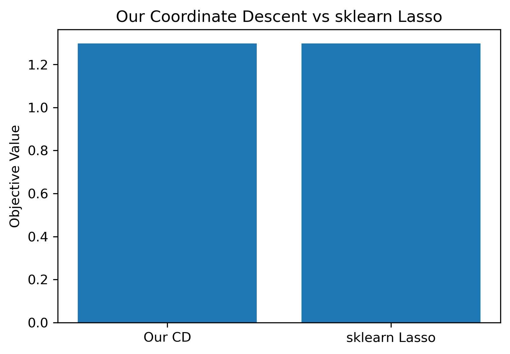
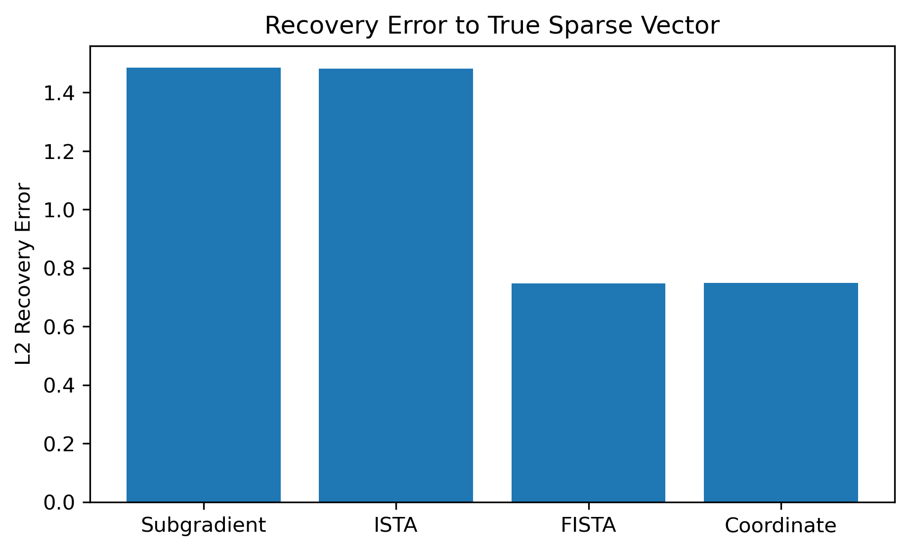

# Efficient Algorithms for Lasso Regression


This repository contains the code and experimental results for the course project 6 : **Efficient Algorithms for Lasso Regression** for *Applied Machine Learning in Python – LMU*.

The project studies the Lasso regression problem

```math
\min_w \frac{1}{2n}\|Xw-y\|_2^2 + \lambda\|w\|_1
```
and compares four optimization algorithms:

- Subgradient Descent
- ISTA
- FISTA
- Coordinate Descent

In this project, we implemented and evaluated four optimization methods for Lasso regression: Subgradient Descent, ISTA, FISTA, and Coordinate Descent. Our experiments investigated convergence speed through loss-versus-iteration curves, the final sparsity patterns of the learned coefficient vectors, the evolution of the Lasso solution path as \(\lambda\) approaches zero, and the robustness of each method to different initialization schemes and regularization strengths. To validate our implementations, we further compared the results with sklearn’s Lasso solver as a standard reference. Finally, the observed behavior was examined on the real-world Diabetes dataset to assess whether the conclusions from the synthetic experiments generalize to practical data.

## Project Structure

```text
.
├── README.md
├── main.py
├── Efficient Algorithms for Lasso Regression Report.pdf
└── figures/
    ├── convergence.png
    ├── sparsity_lambda.png
    ├── lasso_path.png
    ├── recovery_error.png
    ├── sklearn_comparison.png
    ├── init_Subgradient.png
    ├── init_ISTA.png
    ├── init_FISTA.png
    ├── init_CoordinateDescent.png
    ├── initialization_final_objective.png
    ├── short_run_initialization_sensitivity.png
    ├── regularization_distance_to_true_w.png
    ├── regularization_strength_robustness.png
    ├── lambda_heatmap.png
    ├── diabetes_convergence_speed.png
    ├── diabetes_sparsity_vs_regularization.png
    ├── diabetes_test_mse_vs_regularization.png
    └── diabetes_coefficient_heatmap.png
```


## Requirements

The code was written in Python and uses the following packages:

```text
numpy
pandas
matplotlib
scikit-learn
```

Install the requirements with:

```bash
pip install numpy pandas matplotlib scikit-learn
```

Alternatively, if you use conda:

```bash
conda install numpy pandas matplotlib scikit-learn
```

## Running the Experiments

To reproduce all experiments and figures, run:

```bash
python main.py
```

The script automatically creates a folder called `figures/` and saves all generated plots there.

You can also run the script inside Jupyter Notebook or JupyterLab with:

```python
%run main.py
```

## Experiments and Results

### 3.1 Convergence


This experiment compares the convergence behavior of Subgradient Descent, ISTA, FISTA, and Coordinate Descent on the synthetic Lasso problem. The plot shows the objective value over iterations or coordinate-descent sweeps.

Subgradient Descent and ISTA both decrease the objective value slowly, and their curves almost overlap under the chosen step size. This indicates that, although both methods are able to reduce the objective, they require many iterations to approach a good solution. The main difference is that ISTA uses the soft-thresholding operator, which can produce exact zeros, while Subgradient Descent only updates coefficients through the subgradient of the L1 penalty.

FISTA converges much faster than ISTA because it adds Nesterov acceleration to the proximal-gradient update. Its objective value drops sharply in the early iterations and reaches a much lower value than Subgradient Descent and ISTA within the same iteration budget.

Coordinate Descent performs best in terms of convergence speed. Since it updates one coordinate at a time using a closed-form soft-thresholding step, it reaches the lowest objective value within only a few epochs. This makes it especially efficient for Lasso regression.

| Solver | Final objective |
|---|---:|
| Subgradient Descent | 1.393 |
| ISTA | 1.387 |
| FISTA | 1.298 |
| Coordinate Descent | 1.298 |

Overall, the convergence experiment shows that methods based on soft-thresholding are better suited for Lasso optimization than plain Subgradient Descent. FISTA and Coordinate Descent reach substantially better objective values under the same computational budget.

---

### 3.2 Sparsity and Lasso Path


The sparsity experiment studies how the number of nonzero coefficients changes as the regularization parameter `lambda` increases. A larger `lambda` puts more weight on the L1 penalty, so the solution is expected to become sparser.

The plot confirms this behavior. For ISTA, FISTA, and Coordinate Descent, the number of selected coefficients decreases clearly as `lambda` becomes larger. This is because all three methods use soft-thresholding, which can shrink small coefficients exactly to zero.

Subgradient Descent behaves differently. Even when `lambda` increases, it keeps many coefficients nonzero. This happens because the subgradient update does not contain an explicit thresholding step. As a result, coefficients may become small, but they are rarely set exactly to zero. Therefore, Subgradient Descent produces denser solutions and is less effective for feature selection.


The Lasso path experiment shows the reverse perspective: it tracks the number of nonzero coefficients as `lambda` decreases. When `lambda` is large, the regularization is strong and only a few coefficients remain active. As `lambda` becomes smaller, the regularization weakens and more coefficients enter the model.

This behavior matches the theoretical intuition of Lasso regression. Strong regularization leads to sparse models, while weaker regularization allows more features to contribute to the prediction. The Lasso path therefore illustrates how feature selection changes continuously across different regularization strengths.

---

### 3.3 Sparse Recovery

Sparse recovery is evaluated on the synthetic dataset because the true coefficient vector is known. The goal is not only to minimize the objective value, but also to recover the original sparse structure of the ground-truth vector.

The first metric is the L2 recovery error:

```text
||w_hat - w*||_2
```

where `w_hat` is the estimated coefficient vector and `w*` is the true coefficient vector. A smaller value means that the estimated coefficients are closer to the true sparse vector.

| Method | L2 recovery error |
|---|---:|
| Subgradient Descent | 1.486 |
| ISTA | 1.483 |
| FISTA | 0.748 |
| Coordinate Descent | 0.749 |

FISTA and Coordinate Descent achieve much smaller recovery errors than Subgradient Descent and ISTA. This shows that they estimate the true coefficient values more accurately. Subgradient Descent and ISTA both reduce the objective, but their final coefficient vectors remain farther away from the ground truth.

Support recovery is used to evaluate whether the methods identify the correct nonzero positions of the true coefficient vector.

| Method | Precision | Recall | F1 |
|---|---:|---:|---:|
| Subgradient Descent | 0.051 | 1.000 | 0.096 |
| ISTA | 0.185 | 1.000 | 0.313 |
| FISTA | 0.345 | 1.000 | 0.513 |
| Coordinate Descent | 0.357 | 1.000 | 0.526 |

All methods achieve recall equal to 1.000, which means that they successfully recover all 10 truly nonzero coefficients. However, precision differs strongly across methods.

Subgradient Descent has very low precision because it selects many false-positive features. In other words, it includes the true nonzero coefficients, but it also keeps many irrelevant coefficients active. ISTA improves precision because soft-thresholding removes more unnecessary coefficients. FISTA and Coordinate Descent achieve the best support recovery, with higher precision and higher F1-scores.

This result shows that FISTA and Coordinate Descent are better at recovering the sparse structure of the true model. They not only fit the objective well, but also produce more interpretable sparse solutions.



The Coordinate Descent implementation is also compared with `sklearn.linear_model.Lasso`. The two methods match almost exactly: they reach the same objective value, select the same number of nonzero coefficients, and obtain the same recovery error.

| Method | Objective value | Nonzero coefficients | Recovery error |
|---|---:|---:|---:|
| Our Coordinate Descent | 1.2976 | 28 | 0.7485 |
| sklearn Lasso | 1.2976 | 28 | 0.7485 |

This validates the correctness of the implemented Coordinate Descent solver.

---

### 3.4 Robustness

The robustness experiments test whether the solver behavior is stable under different initializations and different regularization strengths. These experiments are important because a good optimization method should not only perform well in one fixed setting, but should also behave reliably under small changes in the experimental setup.

---

### 3.4.1 Robustness to Initialization

The initialization experiment compares three different starting points:

- zero initialization
- small random initialization
- large random initialization

The goal is to test whether the final solution depends strongly on the initial coefficient vector.


For Subgradient Descent, different initializations lead to different early-stage trajectories, but the objective values become closer after more iterations. The method is relatively slow, so the convergence path still reflects the effect of initialization for a longer time.


ISTA shows a similar pattern. The three initialization schemes eventually move toward similar objective values, but convergence is still slow compared with FISTA and Coordinate Descent. This confirms that ISTA is stable in the long run, but not the fastest method.


FISTA is much less affected by initialization after the first iterations. Because of its acceleration step, it rapidly reduces the objective value and reaches a similar final level for all three initializations. This suggests that FISTA is robust and efficient at the same time.


Coordinate Descent also reaches nearly the same final objective across different initializations. Since each coordinate update directly solves a one-dimensional Lasso subproblem, the method quickly corrects the initial coefficient values.


The final-objective comparison confirms that all four solvers are robust to initialization after sufficient iterations. Zero, small random, and large random initialization lead to nearly the same final objective for each solver.


The short-run experiment gives a more detailed picture. When the number of iterations is limited, solver differences become more visible. FISTA and Coordinate Descent reach good solutions quickly, while Subgradient Descent and ISTA remain farther from convergence. Therefore, initialization has little effect in the long-run setting, but the choice of solver matters strongly when the iteration budget is small.

---

### 3.4.2 Robustness to Regularization Strength

The regularization-strength experiment varies `lambda / lambda_max` and measures the L2 distance between the estimated coefficient vector and the true sparse vector:

```text
||w_hat - w*||_2
```

This metric is available only for the synthetic dataset because the true coefficient vector is known.


The line plot shows how the recovery error changes across different regularization levels. For ISTA, FISTA, and Coordinate Descent, the recovery error decreases steadily as `lambda` becomes smaller. This means that weaker regularization allows these methods to recover the true coefficient vector more accurately in this synthetic setting.

Subgradient Descent behaves less consistently. Its performance is more sensitive to the choice of `lambda`, and it performs best only at an intermediate regularization level. This again reflects the weakness of Subgradient Descent for producing exact sparsity.


The heatmap provides a compact comparison across solvers and regularization values. ISTA, FISTA, and Coordinate Descent show very similar patterns, especially for smaller values of `lambda / lambda_max`. Their recovery errors decrease smoothly and consistently.

In contrast, Subgradient Descent has a less stable pattern across the heatmap. It does not benefit from decreasing `lambda` as consistently as the soft-thresholding-based methods.

Overall, the regularization robustness experiment shows that proximal and coordinate-wise methods are more reliable across different regularization strengths. They recover the sparse ground-truth vector more accurately and behave more predictably than Subgradient Descent.

---

### 3.5 Validation on the Diabetes Dataset

The synthetic experiments are useful because the true sparse vector is known. However, to evaluate the solvers on real data, the methods are also tested on the scikit-learn Diabetes dataset.

The Diabetes experiment evaluates:

- test MSE
- sparsity of the learned coefficient vector
- selected features
- coefficient values at the best regularization strength
- comparison with `sklearn.linear_model.Lasso`


The convergence plot on the Diabetes dataset confirms the pattern observed in the synthetic experiment. FISTA and Coordinate Descent reduce the training objective much faster than Subgradient Descent and ISTA. This suggests that the efficiency advantage of accelerated and coordinate-wise methods is not limited to synthetic data.


The test MSE plot shows the predictive performance of each solver across different values of `lambda / lambda_max`. FISTA, Coordinate Descent, and sklearn Lasso achieve nearly identical test MSE values. Their curves are very close, which indicates that the custom implementations reproduce the behavior of a standard Lasso solver well.

Subgradient Descent and ISTA also reach similar test MSE values, but they produce less sparse solutions. This means that comparable prediction error does not necessarily imply comparable feature-selection behavior.


The sparsity plot shows how many Diabetes features remain selected as the regularization strength changes. Subgradient Descent keeps more features active and gives the densest solutions. ISTA produces a sparser model, while FISTA, Coordinate Descent, and sklearn Lasso produce highly similar sparsity patterns.

This result is important because Lasso is often used not only for prediction, but also for feature selection. In this respect, FISTA and Coordinate Descent behave more like the reference sklearn implementation.

| Solver | Best lambda ratio | Best test MSE | Sparsity at best lambda | Selected features |
|---|---:|---:|---:|---|
| Subgradient Descent | 0.046416 | 2801.133037 | 10 | bmi, s5, bp, s3, sex, s1, s6, s2, s4, age |
| ISTA | 0.046416 | 2801.078318 | 8 | bmi, s5, bp, s3, sex, s1, s6, s2 |
| FISTA | 0.046416 | 2798.609930 | 7 | bmi, s5, bp, s3, sex, s1, s6 |
| Coordinate Descent | 0.046416 | 2798.601225 | 7 | bmi, s5, bp, s3, sex, s1, s6 |
| sklearn Lasso | 0.046416 | 2798.601223 | 7 | bmi, s5, bp, s3, sex, s1, s6 |

All methods obtain their best test MSE at the same lambda ratio, 0.046416. FISTA, Coordinate Descent, and sklearn Lasso achieve nearly identical best test MSE values and select exactly the same seven features: `bmi`, `s5`, `bp`, `s3`, `sex`, `s1`, and `s6`.

ISTA selects one additional feature, `s2`, while Subgradient Descent keeps all ten features. This confirms again that Subgradient Descent is less effective at producing sparse solutions.


The coefficient heatmap shows the coefficient values selected by each solver at its best lambda value. FISTA, Coordinate Descent, and sklearn Lasso have almost identical coefficient patterns, which further confirms that the implemented Coordinate Descent method matches the reference solver.

The heatmap also shows that the most influential features are selected consistently across the stronger solvers. In contrast, Subgradient Descent keeps small nonzero coefficients for more features, making the model less sparse and less interpretable.

Overall, the Diabetes validation supports the conclusions from the synthetic experiments: Coordinate Descent performs best overall, FISTA is also highly effective, and Subgradient Descent is useful as a baseline but less suitable for sparse Lasso optimization.

## Main Results

### Convergence


FISTA and Coordinate Descent converge faster than Subgradient Descent and ISTA. Coordinate Descent reaches a low objective value within only a few sweeps.

| Solver | Final objective |
|---|---:|
| Subgradient Descent | 1.393 |
| ISTA | 1.387 |
| FISTA | 1.298 |
| Coordinate Descent | 1.298 |

### Sparsity and Lasso Path


As the regularization strength \(\lambda\) increases, the number of nonzero coefficients decreases. Subgradient Descent remains dense because it rarely sets coefficients exactly to zero, while ISTA, FISTA, and Coordinate Descent produce sparse solutions through soft-thresholding.


The Lasso path confirms the expected behavior: as \(\lambda\) decreases, regularization becomes weaker and more coefficients enter the model.

### Sparse Recovery



| Method | \( \|\hat{w} - w^*\|_2 \) |
|---|---:|
| Subgradient Descent | 1.486 |
| ISTA | 1.483 |
| FISTA | 0.748 |
| Coordinate Descent | 0.749 |

FISTA and Coordinate Descent recover the true sparse vector more accurately than Subgradient Descent and ISTA.

### Support Recovery

| Method | Precision | Recall | F1 |
|---|---:|---:|---:|
| Subgradient Descent | 0.051 | 1.000 | 0.096 |
| ISTA | 0.185 | 1.000 | 0.313 |
| FISTA | 0.345 | 1.000 | 0.513 |
| Coordinate Descent | 0.357 | 1.000 | 0.526 |

All methods recover the true nonzero coefficients, so recall is 1.000 for all solvers. However, Subgradient Descent selects many false positives, while FISTA and Coordinate Descent achieve much higher precision.

### Comparison with sklearn Lasso


Our Coordinate Descent implementation matches `sklearn.linear_model.Lasso` almost exactly on the synthetic experiment.

| Method | Objective value | Nonzero coefficients | Recovery error |
|---|---:|---:|---:|
| Our Coordinate Descent | 1.2976 | 28 | 0.7485 |
| sklearn Lasso | 1.2976 | 28 | 0.7485 |

### Robustness to Initialization


After sufficient iterations, all solvers reach nearly the same final objective under zero, small random, and large random initialization. This indicates that the final optimization result is robust to initialization.

The short-run experiment shows that initialization matters more when the number of iterations is limited:


### Robustness to Regularization Strength


FISTA and Coordinate Descent are more robust across different regularization strengths. Their recovery errors decrease steadily as \(\lambda\) becomes smaller. Subgradient Descent is more sensitive to \(\lambda\) and performs best only at an intermediate regularization level.

## Diabetes Dataset Results

### Test MSE


The best validation results are obtained at the same regularization ratio for all solvers.

| Solver | Best \(\lambda / \lambda_{\max}\) | Best test MSE | Sparsity at best \(\lambda\) | Selected features |
|---|---:|---:|---:|---|
| Subgradient Descent | 0.046416 | 2801.133037 | 10 | bmi, s5, bp, s3, sex, s1, s6, s2, s4, age |
| ISTA | 0.046416 | 2801.078318 | 8 | bmi, s5, bp, s3, sex, s1, s6, s2 |
| FISTA | 0.046416 | 2798.609930 | 7 | bmi, s5, bp, s3, sex, s1, s6 |
| Coordinate Descent | 0.046416 | 2798.601225 | 7 | bmi, s5, bp, s3, sex, s1, s6 |
| sklearn Lasso | 0.046416 | 2798.601223 | 7 | bmi, s5, bp, s3, sex, s1, s6 |

### Feature Selection


FISTA, Coordinate Descent, and sklearn Lasso select the same seven features on the Diabetes dataset. ISTA selects one additional feature, while Subgradient Descent keeps all ten features.

## Reproducibility Notes

- The synthetic experiment uses `np.random.seed(42)`.
- The Diabetes train-test split uses `random_state=42`.
- All figures are saved automatically to the `figures/` folder.
- Results may differ slightly across machines because of floating-point precision, but the qualitative conclusions should remain the same.

## Pre-trained Models

This project does not use pre-trained models. All solvers are implemented directly for Lasso regression and are run from scratch.

## Report

The full project report is included as:

```text
Efficient Algorithms for Lasso Regression Report.pdf
```

## Authors

- Yuehangsha Huang
- Mengying Li

## Contributing

This repository is intended for a course project submission. External contributions are not expected.

## License

This project is for educational use in the LMU *Applied Machine Learning in Python* course. No external open-source license is specified.
