# Efficient Algorithms for Lasso Regression

This repository contains the code and experimental results for the course project **Efficient Algorithms for Lasso Regression** for *Applied Machine Learning in Python - LMU*.

The project studies the Lasso regression problem:

```math
\min_w \frac{1}{2n}\|Xw-y\|_2^2 + \lambda\|w\|_1
```

We implemented and evaluated four optimization methods for Lasso regression:

- Subgradient Descent
- ISTA
- FISTA
- Coordinate Descent

The experiments evaluate both optimization behavior and statistical performance. We analyze convergence speed using objective-value curves, sparsity using the number of nonzero coefficients, sparse recovery using recovery error and support metrics, robustness under different initializations and regularization strengths, and real-data performance on the scikit-learn Diabetes dataset. We also compare our Coordinate Descent implementation with `sklearn.linear_model.Lasso` as a reference implementation.

---

## Project Structure

```text
.
├── README.md
├── main.py
├── Efficient Algorithms for Lasso Regression Report.pdf
└── figures/
    ├── convergence.png
    ├── sparsity_lambda.png
    ├── lasso_path.png
    ├── recovery_error.png
    ├── sklearn_comparison.png
    ├── init_Subgradient.png
    ├── init_ISTA.png
    ├── init_FISTA.png
    ├── init_CoordinateDescent.png
    ├── initialization_final_objective.png
    ├── short_run_initialization_sensitivity.png
    ├── regularization_distance_to_true_w.png
    ├── regularization_strength_robustness.png
    ├── lambda_heatmap.png
    ├── diabetes_convergence_speed.png
    ├── diabetes_sparsity_vs_regularization.png
    ├── diabetes_test_mse_vs_regularization.png
    └── diabetes_coefficient_heatmap.png
```

---

## Requirements

The code was written in Python and uses the following packages:

```text
numpy
pandas
matplotlib
scikit-learn
```

Install the requirements with:

```bash
pip install numpy pandas matplotlib scikit-learn
```

Alternatively, if you use conda:

```bash
conda install numpy pandas matplotlib scikit-learn
```

---

## Running the Experiments

To reproduce all experiments and figures, run:

```bash
python main.py
```

The script automatically creates a folder called `figures/` and saves all generated plots there.

You can also run the script inside Jupyter Notebook or JupyterLab with:

```python
%run main.py
```

---

## Experiments and Results

### 3.1 Convergence

This experiment compares the convergence behavior of Subgradient Descent, ISTA, FISTA, and Coordinate Descent on the synthetic Lasso problem. The figure reports the objective value over iterations or coordinate-descent sweeps.

<table>
  <tr>
    <td width="58%" align="center">
      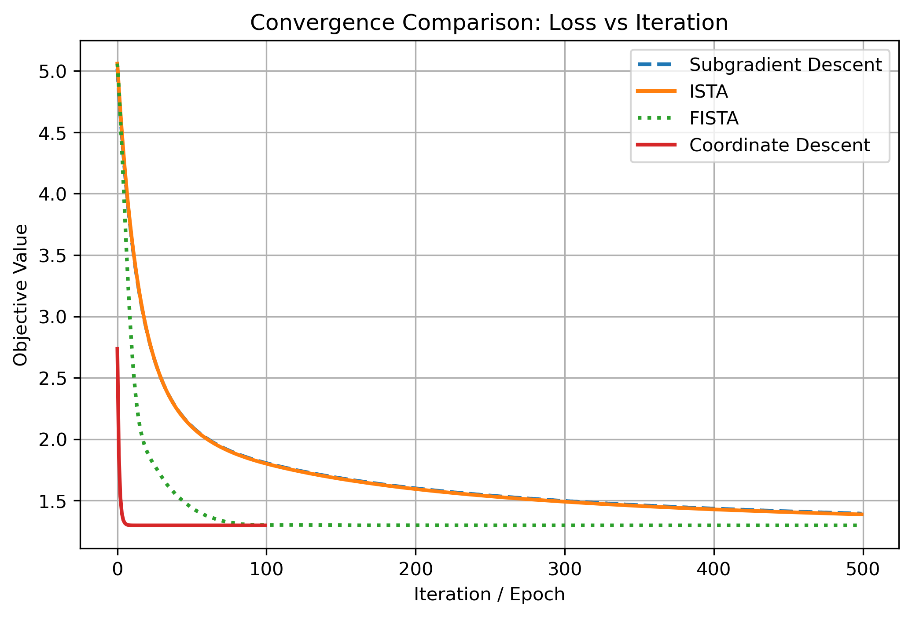<br>
      <sub><b>Figure 1.</b> Objective value versus iteration.</sub>
    </td>
    <td width="42%" valign="top">
      <table>
        <tr>
          <th>Solver</th>
          <th>Final objective</th>
        </tr>
        <tr>
          <td>Subgradient Descent</td>
          <td align="right">1.393</td>
        </tr>
        <tr>
          <td>ISTA</td>
          <td align="right">1.387</td>
        </tr>
        <tr>
          <td>FISTA</td>
          <td align="right">1.298</td>
        </tr>
        <tr>
          <td>Coordinate Descent</td>
          <td align="right">1.298</td>
        </tr>
      </table>
    </td>
  </tr>
</table>

Subgradient Descent and ISTA decrease the objective slowly, and their curves almost overlap under the chosen step size. Although both methods reduce the objective, they require many iterations to approach a good solution. ISTA has the advantage of using soft-thresholding, which can set coefficients exactly to zero, while Subgradient Descent only uses the subgradient of the L1 penalty.

FISTA converges much faster than ISTA because it adds Nesterov acceleration to the proximal-gradient update. Coordinate Descent performs best in terms of convergence speed, since each coordinate update solves a one-dimensional soft-thresholding problem. Overall, FISTA and Coordinate Descent are much more efficient than plain Subgradient Descent for Lasso optimization.

---

### 3.2 Sparsity and Lasso Path

The sparsity experiment studies how the number of nonzero coefficients changes as the regularization strength λ changes. Larger λ values put more weight on the L1 penalty, so the solution is expected to become sparser.

<table>
  <tr>
    <td align="center" width="50%">
      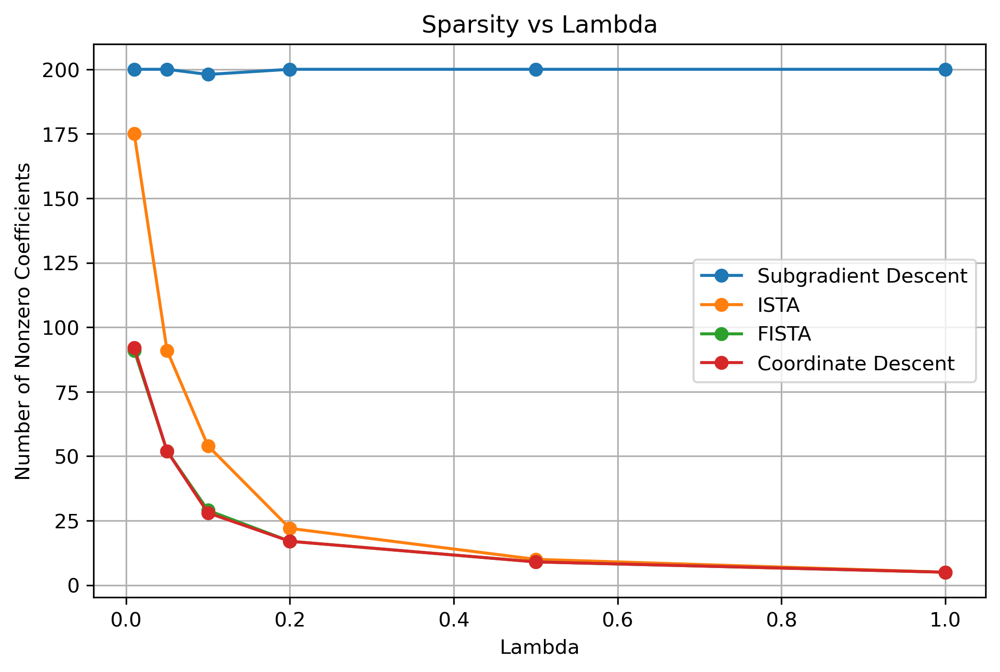<br>
      <sub><b>Figure 2.</b> Sparsity versus λ.</sub>
    </td>
    <td align="center" width="50%">
      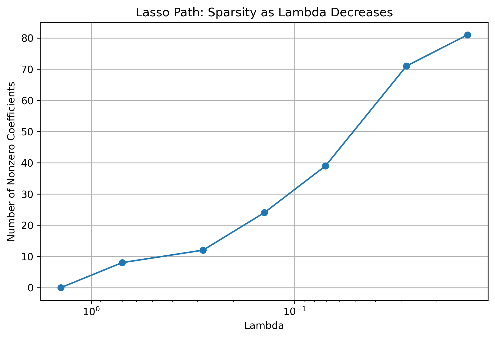<br>
      <sub><b>Figure 3.</b> Lasso path as λ decreases.</sub>
    </td>
  </tr>
</table>

The sparsity plot confirms that increasing λ leads to fewer nonzero coefficients for ISTA, FISTA, and Coordinate Descent. These methods use soft-thresholding, which can shrink small coefficients exactly to zero. Therefore, they are effective for producing sparse Lasso solutions.

Subgradient Descent behaves differently. Even when λ increases, it keeps many coefficients nonzero. This happens because the subgradient update does not include an explicit thresholding step. Coefficients may become small, but they are rarely set exactly to zero. As a result, Subgradient Descent produces denser solutions and is less suitable for feature selection.

The Lasso path gives the reverse perspective. When λ is large, regularization is strong and only a few coefficients remain active. As λ decreases, regularization becomes weaker and more coefficients enter the model. This matches the expected behavior of Lasso regression.

---

### 3.3 Sparse Recovery

Sparse recovery is evaluated on the synthetic dataset because the true coefficient vector is known. The goal is not only to minimize the objective value, but also to recover the original sparse structure of the ground-truth vector.

The first metric is the L2 recovery error, ‖ŵ − w*‖<sub>2</sub>, where ŵ is the estimated coefficient vector and w* is the true coefficient vector. A smaller value means that the estimated coefficients are closer to the ground truth.

<table>
  <tr>
    <td width="42%" valign="top">
      <table>
        <tr>
          <th>Method</th>
          <th>L2 recovery error</th>
        </tr>
        <tr>
          <td>Subgradient Descent</td>
          <td align="right">1.486</td>
        </tr>
        <tr>
          <td>ISTA</td>
          <td align="right">1.483</td>
        </tr>
        <tr>
          <td>FISTA</td>
          <td align="right">0.748</td>
        </tr>
        <tr>
          <td>Coordinate Descent</td>
          <td align="right">0.749</td>
        </tr>
      </table>
    </td>
    <td width="58%" valign="top">
      <table>
        <tr>
          <th>Method</th>
          <th>Precision</th>
          <th>Recall</th>
          <th>F1</th>
        </tr>
        <tr>
          <td>Subgradient Descent</td>
          <td align="right">0.051</td>
          <td align="right">1.000</td>
          <td align="right">0.096</td>
        </tr>
        <tr>
          <td>ISTA</td>
          <td align="right">0.185</td>
          <td align="right">1.000</td>
          <td align="right">0.313</td>
        </tr>
        <tr>
          <td>FISTA</td>
          <td align="right">0.345</td>
          <td align="right">1.000</td>
          <td align="right">0.513</td>
        </tr>
        <tr>
          <td>Coordinate Descent</td>
          <td align="right">0.357</td>
          <td align="right">1.000</td>
          <td align="right">0.526</td>
        </tr>
      </table>
    </td>
  </tr>
</table>

FISTA and Coordinate Descent achieve much smaller recovery errors than Subgradient Descent and ISTA. This shows that they estimate the true coefficient vector more accurately. All methods achieve recall equal to 1.000, meaning that all 10 true nonzero coefficients are recovered. However, precision differs strongly across methods.

Subgradient Descent has very low precision because it selects many false-positive features. ISTA improves precision because soft-thresholding removes more irrelevant coefficients. FISTA and Coordinate Descent achieve the best support recovery, with higher precision and higher F1-scores.

<table>
  <tr>
    <td width="50%" valign="top">
      <table>
        <tr>
          <th>Method</th>
          <th>Objective</th>
          <th>Nonzero</th>
          <th>Error</th>
        </tr>
        <tr>
          <td>Our Coordinate Descent</td>
          <td align="right">1.2976</td>
          <td align="right">28</td>
          <td align="right">0.7485</td>
        </tr>
        <tr>
          <td>sklearn Lasso</td>
          <td align="right">1.2976</td>
          <td align="right">28</td>
          <td align="right">0.7485</td>
        </tr>
      </table>
    </td>
  </tr>
</table>

Our Coordinate Descent implementation matches `sklearn.linear_model.Lasso` almost exactly, with the same objective value, number of nonzero coefficients, and recovery error. This validates the correctness of the implementation.

---

### 3.4 Robustness

The robustness experiments test whether the solvers behave reliably under different initialization schemes and different regularization strengths. A good Lasso solver should perform well not only in one fixed setting, but also under reasonable changes in the experimental setup.

#### 3.4.1 Robustness to Initialization

We compare three starting points: zero initialization, small random initialization, and large random initialization. The goal is to test whether the final solution depends strongly on the initial coefficient vector.

<table>
  <tr>
    <td align="center" width="50%">
      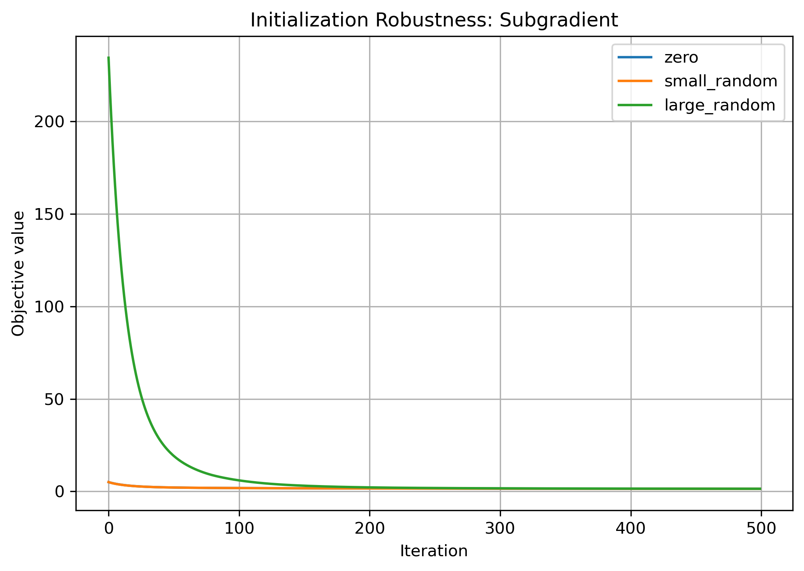<br>
      <sub><b>Subgradient Descent</b></sub>
    </td>
    <td align="center" width="50%">
      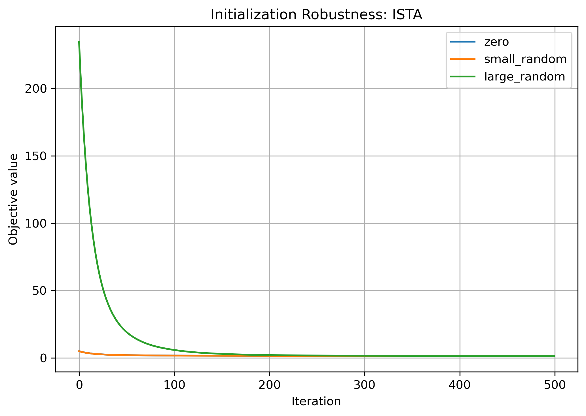<br>
      <sub><b>ISTA</b></sub>
    </td>
  </tr>
  <tr>
    <td align="center" width="50%">
      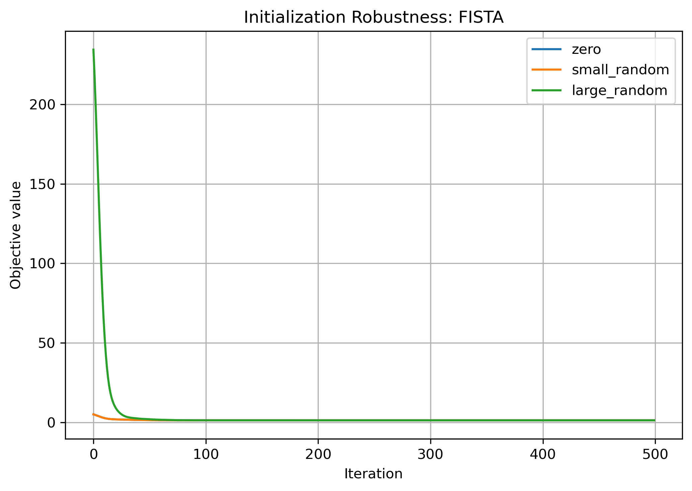<br>
      <sub><b>FISTA</b></sub>
    </td>
    <td align="center" width="50%">
      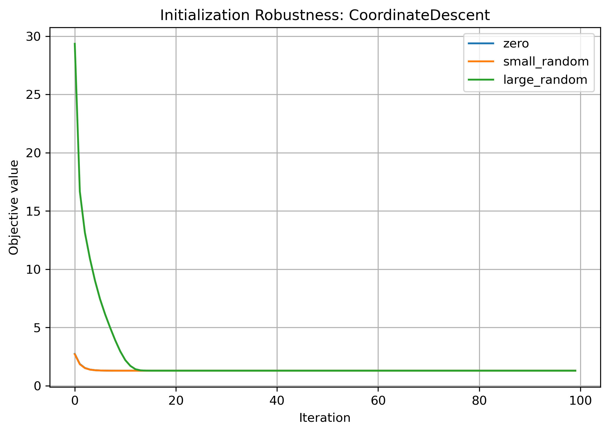<br>
      <sub><b>Coordinate Descent</b></sub>
    </td>
  </tr>
</table>

For Subgradient Descent and ISTA, different initializations lead to slightly different early-stage trajectories, and convergence remains relatively slow. FISTA is much less affected after the first few iterations because acceleration rapidly reduces the objective value. Coordinate Descent also reaches nearly the same final objective across all initializations, since each coordinate update quickly corrects the coefficient values.

<table>
  <tr>
    <td align="center" width="50%">
      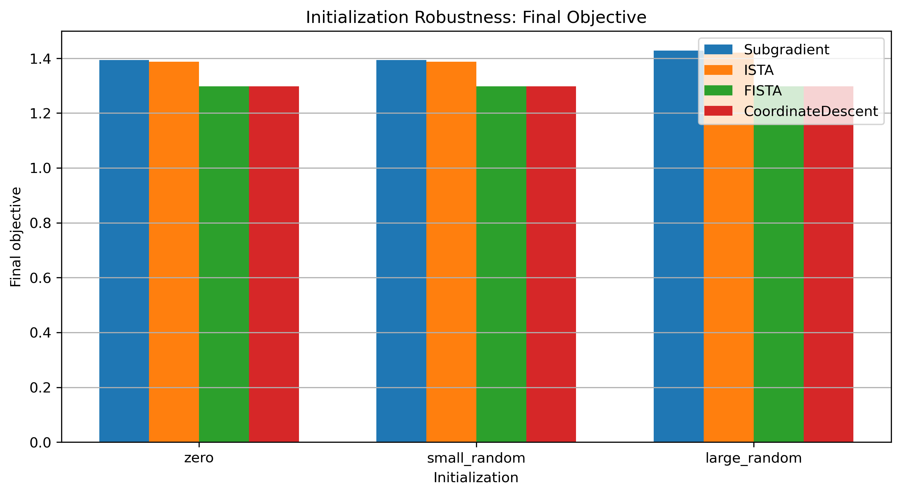<br>
      <sub><b>Figure 5.</b> Final objective under different initializations.</sub>
    </td>
    <td align="center" width="50%">
      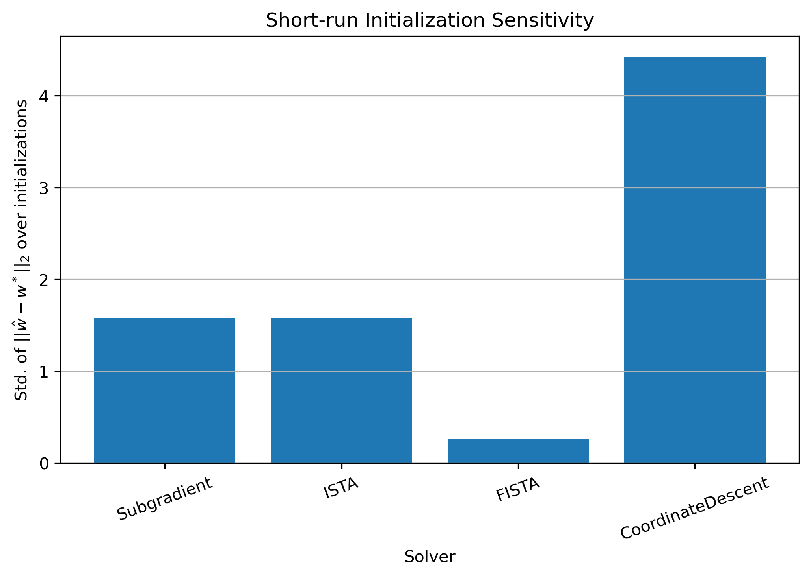<br>
      <sub><b>Figure 6.</b> Short-run initialization sensitivity.</sub>
    </td>
  </tr>
</table>

The final-objective comparison shows that all solvers are robust to initialization after sufficient iterations. However, the short-run experiment reveals more visible solver differences when the iteration budget is limited. FISTA and Coordinate Descent reach good solutions quickly, while Subgradient Descent and ISTA remain farther from convergence.

#### 3.4.2 Robustness to Regularization Strength

We vary λ / λ<sub>max</sub> and measure the L2 distance between the estimated coefficient vector and the true sparse vector, ‖ŵ − w*‖<sub>2</sub>. This metric is available only for synthetic data because the true coefficient vector is known.

<table>
  <tr>
    <td align="center" width="50%">
      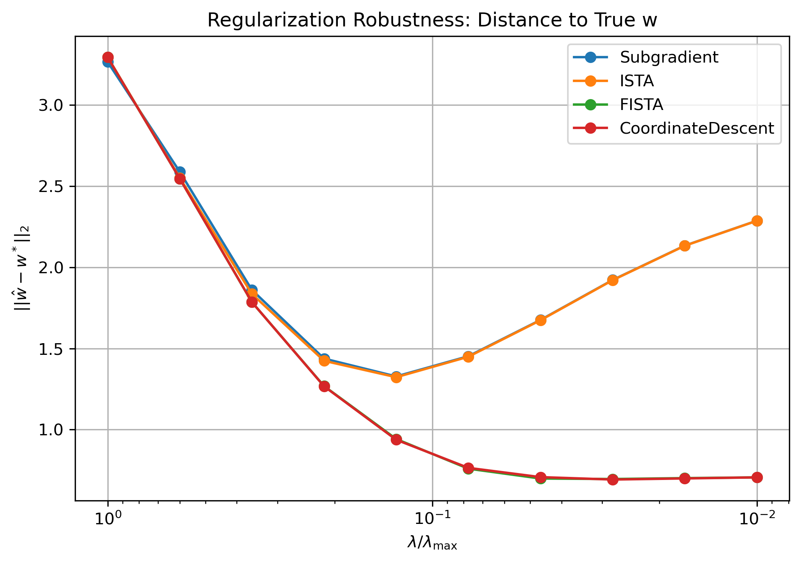<br>
      <sub><b>Figure 7.</b> Distance to true coefficients across λ values.</sub>
    </td>
    <td align="center" width="50%">
      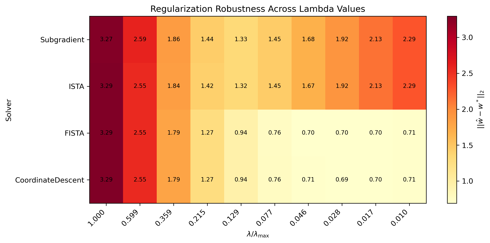<br>
      <sub><b>Figure 8.</b> Heatmap of recovery error across λ values.</sub>
    </td>
  </tr>
</table>

For ISTA, FISTA, and Coordinate Descent, the recovery error decreases steadily as λ becomes smaller. This means that weaker regularization allows these methods to recover the true coefficient vector more accurately in this synthetic setting. Subgradient Descent behaves less consistently and is more sensitive to the choice of λ.

The heatmap provides a compact comparison across solvers and regularization values. ISTA, FISTA, and Coordinate Descent show similar and stable patterns, while Subgradient Descent is less predictable. Overall, proximal and coordinate-wise methods are more robust to regularization strength and recover the sparse ground-truth vector more accurately.

---

### 3.5 Validation on the Diabetes Dataset

The synthetic experiments are useful because the true sparse vector is known. To evaluate the solvers on real data, we also test them on the scikit-learn Diabetes dataset. The evaluation uses test MSE, sparsity, selected features, coefficient heatmaps, and comparison with `sklearn.linear_model.Lasso`.

<table>
  <tr>
    <td align="center" width="50%">
      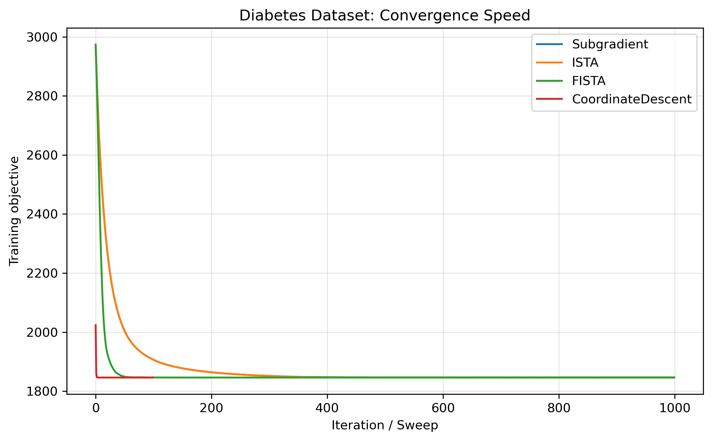<br>
      <sub><b>Figure 9.</b> Convergence speed on the Diabetes dataset.</sub>
    </td>
    <td align="center" width="50%">
      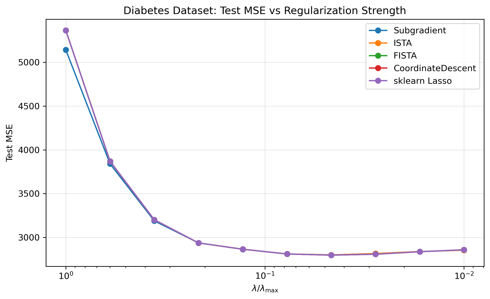<br>
      <sub><b>Figure 10.</b> Test MSE versus regularization strength.</sub>
    </td>
  </tr>
</table>

The Diabetes convergence plot confirms the pattern observed on the synthetic dataset. FISTA and Coordinate Descent reduce the training objective much faster than Subgradient Descent and ISTA. The test MSE plot shows that FISTA, Coordinate Descent, and sklearn Lasso achieve nearly identical prediction performance across λ / λ<sub>max</sub> values.

<table>
  <tr>
    <td align="center" width="50%">
      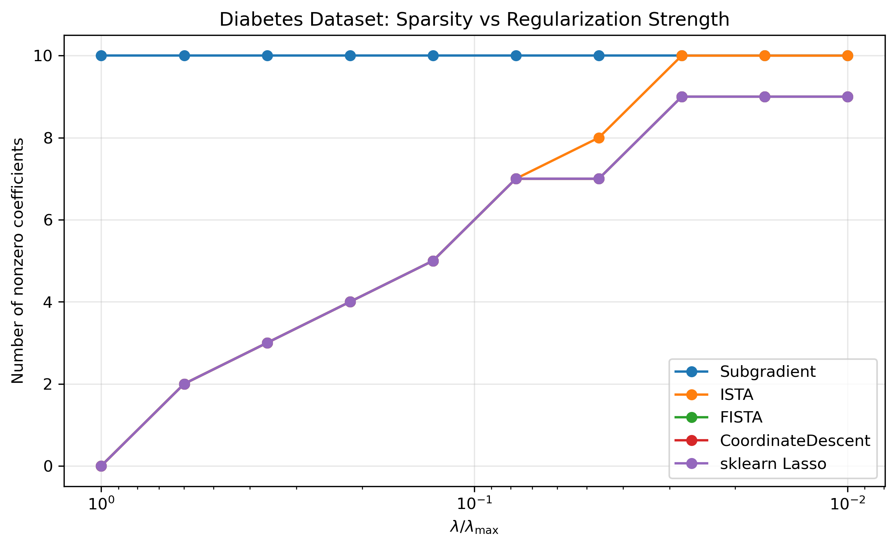<br>
      <sub><b>Figure 11.</b> Sparsity versus regularization strength.</sub>
    </td>
    <td align="center" width="50%">
      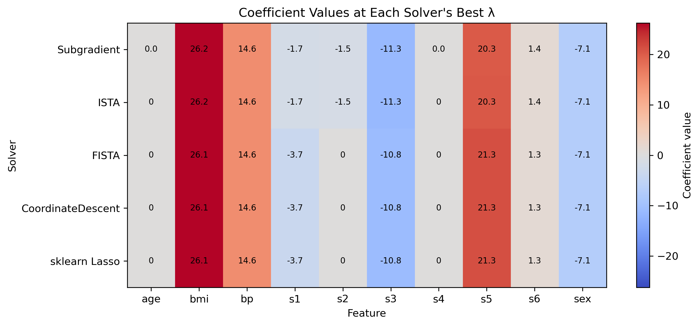<br>
      <sub><b>Figure 12.</b> Coefficients at each solver's best λ.</sub>
    </td>
  </tr>
</table>

The sparsity plot shows that Subgradient Descent keeps more features active and gives the densest solution. ISTA is sparser, while FISTA, Coordinate Descent, and sklearn Lasso produce very similar sparsity patterns. The coefficient heatmap further confirms that FISTA, Coordinate Descent, and sklearn Lasso select almost identical features and coefficient values.

| Solver | Best λ ratio | Best test MSE | Sparsity at best λ | Selected features |
|---|---:|---:|---:|---|
| Subgradient Descent | 0.046416 | 2801.133037 | 10 | bmi, s5, bp, s3, sex, s1, s6, s2, s4, age |
| ISTA | 0.046416 | 2801.078318 | 8 | bmi, s5, bp, s3, sex, s1, s6, s2 |
| FISTA | 0.046416 | 2798.609930 | 7 | bmi, s5, bp, s3, sex, s1, s6 |
| Coordinate Descent | 0.046416 | 2798.601225 | 7 | bmi, s5, bp, s3, sex, s1, s6 |
| sklearn Lasso | 0.046416 | 2798.601223 | 7 | bmi, s5, bp, s3, sex, s1, s6 |

All methods obtain their best test MSE at the same λ ratio, 0.046416. FISTA, Coordinate Descent, and sklearn Lasso achieve almost identical best test MSE values and select exactly the same seven features: `bmi`, `s5`, `bp`, `s3`, `sex`, `s1`, and `s6`. ISTA selects one additional feature, `s2`, while Subgradient Descent keeps all ten features.

Overall, the Diabetes validation supports the conclusions from the synthetic experiments: Coordinate Descent performs best overall, FISTA is also highly effective, and Subgradient Descent is useful as a baseline but less suitable for sparse Lasso optimization.

---

## Reproducibility Notes

- The synthetic experiment uses `np.random.seed(42)`.
- The Diabetes train-test split uses `random_state=42`.
- All figures are saved automatically to the `figures/` folder.
- Results may differ slightly across machines because of floating-point precision, but the qualitative conclusions should remain the same.

---

## Pre-trained Models

This project does not use pre-trained models. All solvers are implemented directly for Lasso regression and are run from scratch.

---

## Report

The full project report is included as:

```text
Efficient Algorithms for Lasso Regression Report.pdf
```

---

## Authors

- Mengying Li
- Yuehangsha Huang

---

---

## Contributing

This repository is intended for a course project submission. External contributions are not expected.

---

## License

This project is for educational use in the LMU *Applied Machine Learning in Python* course. No external open-source license is specified.
